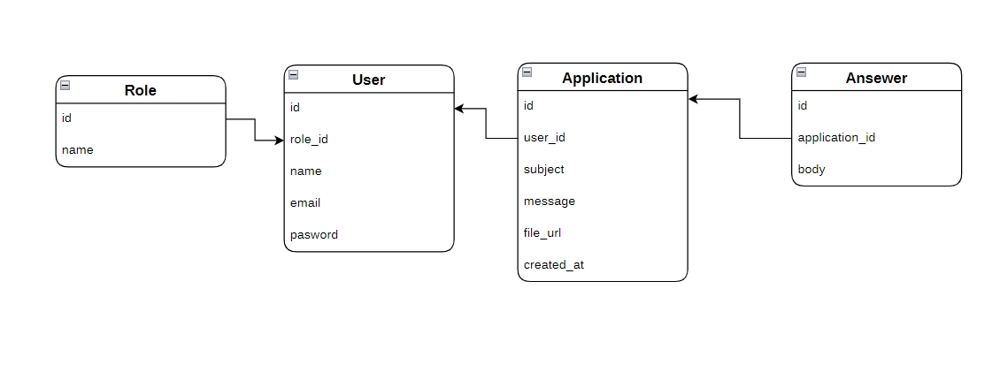

## Menejer client proekti

Bu loyiha client va menejerni bir biriga bog'laydi. Loyiha Quyidagi qismlardan tashkil topgan:

- Mijoz ish beruvchiga forma orqali ariza yuboradi .
- Mijoz bir kunda bir marotba ariza yuborishi mumkin. Mijoz har bi yuborgan arizalarning javobini o'z profili orqali ko'rishi mumkin .
- Menejer esa mijoz yuborgan arizalarni ko'rib javob qaytaradi.

## Installing
```
cp .env.example .env
```

```
composer intall 
```
```or```
```
 composer install --ignore-platform-reqs
```
```
npm install
```
```
php artisan key:generate
```

```
php artisan sail:install
```
```
npm run dev
```
```
php artisan migrate --seed
```
```
php artisan queue:work
```

# .env
-  MAIL_MAILER=log

# Relationships

